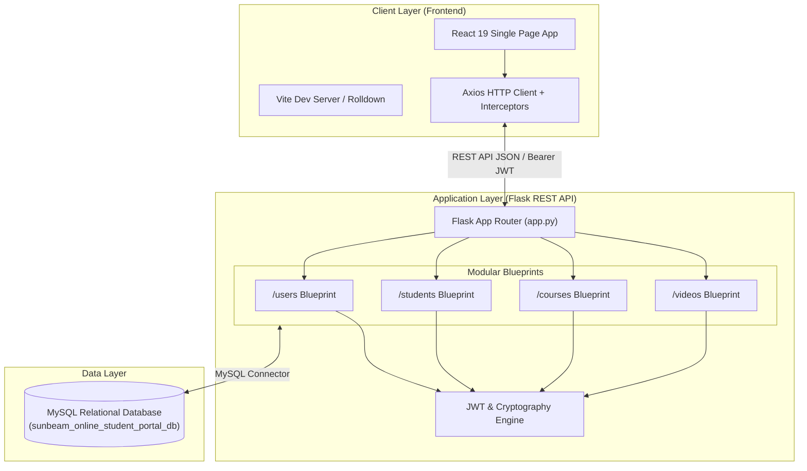
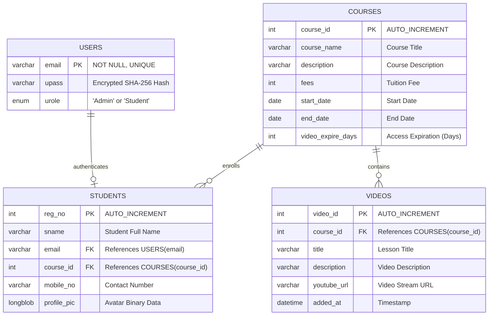

<div align="center">

# ✨ Lumora

### *Empowering Seamless Learning & Education Management*

[](https://react.dev/)
[](https://flask.palletsprojects.com/)
[](https://www.mysql.com/)
[](https://www.python.org/)
[](https://vitejs.dev/)
[](https://jwt.io/)

<p align="center">
  <b>Lumora</b> is a full-stack, enterprise-ready online student portal and learning management platform. Built with a high-performance <b>React 19</b> frontend, a modular <b>Flask REST API</b> backend, and a robust <b>MySQL</b> database, Lumora streamlines course delivery, student enrollment, and video-based learning with role-based security.
</p>

[Key Features](#-key-features) •
[Architecture](#-system-architecture) •
[Tech Stack](#-tech-stack) •
[Getting Started](#-getting-started) •
[API Reference](#-api-endpoints-summary) •
[Database Schema](#-database-schema)

---

</div>

## 🚀 Key Features

### 👑 Admin Portal
* **Course Administration:** Create, update, list, and delete courses with customizable fee structures, start/end dates, and video expiration limits.
* **Video Library Management:** Link embedded YouTube lessons to specific courses for dynamic student learning.
* **Student Registry & Oversight:** Track all enrolled students filtered by course ID, inspect contact details, and view registration metrics.
* **Role Management:** Dedicated high-privilege administrative access with secure initial bootstrapping.

### 🎓 Student Portal
* **Course Discovery & Enrollment:** Browse available active courses and self-register into programs with instant account creation.
* **Curriculum & Video Player:** Access course-specific video lectures and course material seamlessly.
* **Profile Management:** Update personal profile pictures (stored securely in MySQL `LONGBLOB`) and update access credentials.
* **Secure Authentication:** JWT-backed persistent login sessions with token auto-expiry and state synchronization.

### 🛡️ Security & Performance
* **Password Encryption:** Salted SHA-256 password hashing powered by `passlib.hash.sha256_crypt`.
* **JWT Authorization:** Bearer token headers for administrative & student protected routes (`flask-jwt-extended`).
* **Toast Notification Engine:** Real-time feedback via `react-toastify` for fast UI interactions.

---

## 🏗️ System Architecture



---

## 🛠️ Tech Stack

| Domain | Technology | Description |
| :--- | :--- | :--- |
| **Frontend UI** |  | Modern declarative UI component tree |
| **Build Tool** |  | Fast module bundler & hot module replacement |
| **State & Routing**|  | Client-side page navigation & route protection |
| **Styling & UI** |  | Responsive layout grid & custom CSS aesthetics |
| **Backend API** |  | Lightweight WSGI micro-framework |
| **Authentication**|  | Secure token-based authentication |
| **Cryptography** |  | Enterprise-grade password hashing |
| **Database** |  | Relational store with foreign keys & cascading actions |

---

## 🗄️ Database Schema



---

## 📁 Project Structure

```
Lumora/
├── 📂 backend/                   # Python Flask Backend Application
│   ├── 📄 app.py                 # Application Entry Point & Blueprint Registration
│   ├── 📄 schema.sql             # Database Setup & Table Definitions
│   ├── 📂 routes/                # REST API Blueprint Modules
│   │   ├── 📄 users.py           # Admin & Student Auth (/users)
│   │   ├── 📄 students.py        # Enrollment & Profile Endpoints (/students)
│   │   ├── 📄 courses.py         # Course CRUD Management (/courses)
│   │   └── 📄 videos.py          # Video Catalog & Playlists (/videos)
│   └── 📂 utils/                 # Utility Libraries
│       ├── 📄 dbconnection.py    # MySQL Connector Helper
│       └── 📄 utils.py           # JWT Setup & Standard API Response Helpers
├── 📂 frontend/                  # React 19 Frontend Application
│   ├── 📄 package.json           # Frontend Dependencies & Scripts
│   ├── 📄 vite.config.js         # Vite Build Configuration
│   └── 📂 src/                   # React Application Source Code
│       ├── 📄 App.jsx            # Main App & Router Setup
│       ├── 📂 components/        # Navigation Bar & Global Components
│       ├── 📂 pages/             # App Screens (Home, Login, Signup, Manage, etc.)
│       └── 📂 services/          # Axios API Services & Base Config
└── 📄 README.md                  # Project Documentation
```

---

## ⚡ Getting Started

### 📋 Prerequisites
Ensure you have the following installed on your developer machine:
* [Python 3.10+](https://www.python.org/downloads/)
* [Node.js (v18+) & npm](https://nodejs.org/)
* [MySQL Server 8.0+](https://dev.mysql.com/downloads/mysql/)

---

### 🛢️ 1. Database Setup

1. Launch your MySQL server and open your command client or MySQL Workbench.
2. Execute the setup script located in [`backend/schema.sql`](file:///c:/Users/AAYAN/Desktop/Lumora/backend/schema.sql):

```sql
CREATE DATABASE IF NOT EXISTS Sunbeam_Online_Student_Portal_db;
USE Sunbeam_Online_Student_Portal_db;
-- (Run the remaining CREATE TABLE queries inside schema.sql)
```

> [!NOTE]
> Database connection credentials can be configured in [`backend/utils/dbconnection.py`](file:///c:/Users/AAYAN/Desktop/Lumora/backend/utils/dbconnection.py). The default configuration points to `localhost:3306`, user `root`, password `manager`.

---

### 🐍 2. Backend Setup (Flask)

1. Navigate to the backend directory:
   ```bash
   cd backend
   ```
2. Create and activate a Python virtual environment:
   ```bash
   # Windows
   python -m venv venv
   .\venv\Scripts\activate

   # macOS / Linux
   python3 -m venv venv
   source venv/bin/activate
   ```
3. Install required backend dependencies:
   ```bash
   pip install flask flask-cors flask-jwt-extended mysql-connector-python passlib
   ```
4. Run the Flask server:
   ```bash
   python app.py
   ```
   > 🚀 Backend server running on `http://localhost:5000`

---

### 💻 3. Frontend Setup (React + Vite)

1. Open a new terminal and navigate to the frontend directory:
   ```bash
   cd frontend
   ```
2. Install npm packages:
   ```bash
   npm install
   ```
3. Launch the development server:
   ```bash
   npm run dev
   ```
   > 🌐 Frontend app live on `http://localhost:5173`

---

## 🔑 Key Default Credentials

> [!IMPORTANT]
> Use these initial credentials for testing administrative and student access:

* **Admin Sign In:**
  * **Email:** `Admin@gmail.com`
  * **Default Password:** `Admin123`
* **Student Sign Up:**
  * Students can self-register or be enrolled by an Admin.
  * Default generated initial password: `Student123`

---

## 🔌 API Endpoints Summary

### 👤 Authentication & Users (`/users`)
| Method | Endpoint | Description | Auth Required |
| :--- | :--- | :--- | :---: |
| `POST` | `/users/user/signup` | Student account creation | ❌ |
| `POST` | `/users/user/signin` | Student sign in & JWT generation | ❌ |
| `POST` | `/users/Admin/signup` | Bootstrap admin user | ❌ |
| `POST` | `/users/Admin/signin` | Admin sign in & JWT generation | ❌ |
| `GET` | `/users/allactivecourses` | Fetch current active courses | 🔒 Yes |

### 📚 Course Management (`/courses`)
| Method | Endpoint | Description | Auth Required |
| :--- | :--- | :--- | :---: |
| `POST` | `/courses/coursesall` | Retrieve all courses | ❌ |
| `GET` | `/courses/getdateallcourses` | Filter courses by date range | ❌ |
| `POST` | `/courses/addcourses` | Add new course | 🔒 Yes |
| `PUT` | `/courses/updatecourses` | Update course details | 🔒 Yes |
| `DELETE` | `/courses/delcourses` | Remove a course | 🔒 Yes |

### 📹 Video Catalog (`/videos`)
| Method | Endpoint | Description | Auth Required |
| :--- | :--- | :--- | :---: |
| `GET` | `/videos/getvideos` | Get all videos across courses | 🔒 Yes |
| `POST` | `/videos/getvideosbycourse` | Get videos for specific course | ❌ |
| `POST` | `/videos/addvideos` | Attach video to course | 🔒 Yes |
| `PUT` | `/videos/updatevideos` | Update video details | 🔒 Yes |
| `DELETE` | `/videos/deletevideos` | Delete a video | 🔒 Yes |

### 🎓 Students & Enrollment (`/students`)
| Method | Endpoint | Description | Auth Required |
| :--- | :--- | :--- | :---: |
| `GET` | `/students/allenrolledstudentsbycourse` | List all enrolled students | ❌ |
| `POST` | `/students/registerstudent` | Register student to course | ❌ |
| `PUT` | `/students/updatestudentpassword` | Change account password | 🔒 Yes |
| `POST` | `/students/getcoursesofmystudentemail` | Get courses enrolled by student | 🔒 Yes |
| `GET` | `/students/getprofilepic/<reg_no>` | Retrieve student avatar image | 🔒 Yes |
| `PUT` | `/students/updateprofilepic` | Upload profile image (LONGBLOB) | 🔒 Yes |

---

## 🤝 Contributing

Contributions, issues, and feature requests are welcome! Feel free to check the issues page or submit a pull request.

---

<div align="center">

Made with ❤️ for **Lumora — Student Learning Platform**

</div>
